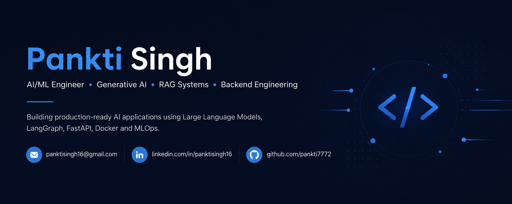

  

<h1 align="center">Hi 👋, I'm Pankti Singh</h1>

<h3 align="center">
AI/ML Engineer • Generative AI • RAG Systems • Backend Engineering
</h3>

Building production-ready AI applications using Large Language Models, LangGraph, FastAPI, Docker and MLOps.

---

# 💼 About Me

AI Engineer passionate about building production-ready AI systems powered by Large Language Models.

- 🤖 Generative AI
- 🧠 RAG Systems
- ⚡ FastAPI
- 🔗 LangChain & LangGraph
- 🐳 Docker & MLOps
- 👁️ Computer Vision
- 📊 Data Analytics

---

# 🚀 Expertise

| AI & GenAI | Backend | MLOps | Analytics |
|------------|---------|--------|-----------|
| LLMs | Python | Docker | Power BI |
| RAG | FastAPI | GitHub Actions | Pandas |
| LangChain | REST APIs | MLflow | NumPy |
| LangGraph | SQL | Kubernetes | SQL |
| AI Agents | Flask | Deployment | Tableau |

---

## 📊 GitHub Analytics

  
  

  

---

# ⭐ Featured Projects

| Project | Description |
|----------|-------------|
| ✈️ Air Bharat Udaan | Aviation RAG Assistant using LangGraph and FAISS |
| 🤖 Multi-Agent Debate DAG | Multi-Agent reasoning with LangGraph |
| 👁️ Visual Defect Detector | Industrial Computer Vision |
| 🎥 TubeQuery | YouTube RAG Assistant |

---

# 💻 Tech Stack

---

# 📚 Currently Learning

- Agentic AI
- AI Evaluation
- Production MLOps
- Kubernetes
- Distributed Systems

---

# 📫 Connect

---

<b>⭐ Building AI that solves real-world problems.</b>

